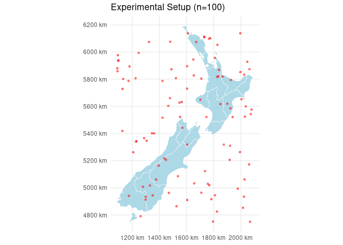
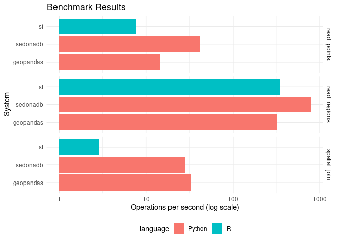

# GeoBench: Spatial Data Benchmarks (NZ)


Benchmarks for spatial data operations using the `spData::nz` dataset
(New Zealand regions).

## Source Code

- [sf (R)](scripts/bench_r.R)
- [geopandas (Python)](scripts/bench_py.py)
- [sedonadb (Python)](scripts/bench_sedona_py.py)

## Experimental Setup

We use the New Zealand regions (16 polygons) and generate 100,000 random
points within the bounding box of New Zealand. The primary operation
benchmarked is a **Spatial Left Join**: joining the region `Name` to
each point.

``` r
library(sf)
library(spData)
library(ggplot2)

data(nz)
set.seed(42)
# Sample 100 points for visualization
bbox_poly <- st_as_sfc(st_bbox(nz))
points_sample <- st_sf(geometry = st_sample(bbox_poly, size = 100))

ggplot() +
  geom_sf(data = nz, fill = "lightblue", color = "white") +
  geom_sf(data = points_sample, color = "red", alpha = 0.5, size = 1) +
  theme_minimal() +
  ggtitle("Experimental Setup (n=100)")
```



## Benchmark Results

Run on 100,000 points and 16 polygons (Regions).

| system    | language | operation    | ops_per_sec |
|:----------|:---------|:-------------|------------:|
| sf        | R        | read_points  |        7.64 |
| sf        | R        | read_regions |      353.79 |
| sf        | R        | spatial_join |        2.91 |
| geopandas | Python   | read_points  |       14.49 |
| geopandas | Python   | read_regions |      318.77 |
| geopandas | Python   | spatial_join |       33.00 |
| sedonadb  | Python   | read_points  |       41.55 |
| sedonadb  | Python   | read_regions |      786.04 |
| sedonadb  | Python   | spatial_join |       27.59 |


